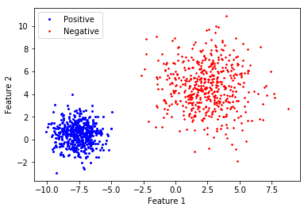
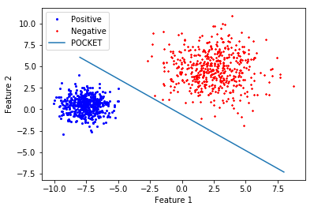
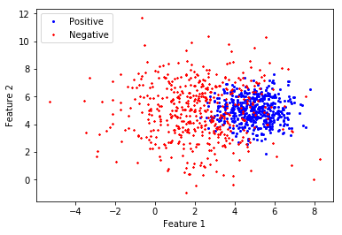

# 第一次机器学习作业

#### 计算机学院-20020129-王悟信-PLA算法
内容：

实现PLA算法和Pocket算法

分别针对数据线性可分与线性不可分进行实验

## PLA算法

PLA算法全称是Perception Linear Algrithm，即线性感知机算法，属于一种最简单的感知机（Perceptron）模型。

感知机模型是机器学习二分类问题中的一个简单模型，对数据集$X=\{x_i\}$，感知机模型的权重系数为$\Omega = \{\omega_i\}$，$b$为偏移常数，PLA算法的输出为：

$$ f = \sum_{i}^{n}\omega_ix_i+b $$

针对第$i$个数据，若$\omega_ix_i+b \geq 0$，则则分为正类，记$y_i = 1$

针对第$i$个数据，若$\omega_ix_i+b < 0$，则则分为负类，记$y_i = -1$

通过以上方式判断样本属于正样本还是负样本

对于寻找最终将数据成功分类的$f$则采取逐点修正的方式，首先任取一个分类面，寻找分类错误的点，然后对其进行修正，使得该点被分类正确；重复以上修正过程直到所有点都被正确分类。

## Pocket算法

在PLA算法的基础上进行改进，每次存储分错数最少的那个模型，设置一定的迭代次数进行下去

## 线性可分

### 生成线性可分数据

首先要生成一组线性可分的数据集，通过设置点坐标表示数据集的分布，则数据集的均值和方差代表了这个数据类型的特征。故首先采用numpy库生成两组正态分布的点集，通过改变其均值和方差获得两组线性可分的数据。


```python
import numpy as np
import matplotlib.pyplot as plt
%matplotlib inline

# 创建训练样本，设每一类都是100个样本
N = 500

# 生成第一类数据
# 假设数据符合正态分布
class1 = np.random.randn(N, 2)
# 平移数据集
class1 = np.add(class1, [-4,4])

# 生成第二类数据
# 假设数据符合正态分布
class2 = 2*np.random.randn(N, 2)
# 平移数据集
class2 = np.add(class2, [6,8])

# 数据中心化
class_ = np.concatenate((class1, class2),0)
class1 = class1 - np.mean(class_)
class2 = class2 - np.mean(class_)

# 数据可视化
x1 = class1[:, 0].T
y1 = class1[:, 1].T
x2 = class2[:, 0].T
y2 = class2[:, 1].T

plt.plot(x1, y1, "bo", markersize=2, label='Positive')
plt.plot(x2, y2, "r*", markersize=2, label='Negative')
plt.xlabel('Feature 1')
plt.ylabel('Feature 2')
plt.legend(loc = 'upper left')
plt.show()

samples = np.concatenate((class1,class2), axis=0)
labels_1 = np.ones(class1.shape[0])
labels_2 = np.ones(class2.shape[0])-2
labels = np.concatenate((labels_1,labels_2), axis=0)
```





## PLA算法实现

1、定义一个PLA类，初始化权重w和偏差b为0。将数据集x及其标签y输入至类中，计算数据的个数与特征的个数；

2、定义符号函数，若分类正确输出1，分类错误输出-1；

3、定义更新函数，根据PLA算法更新规则，定义其梯度与当前权值及偏差相加；

4、定义PLA主体函数，每一次循环均对当前找到的分类错误的点进行更新，直至找不到错误点为止结束PLA算法；


```python
class PLA:
    def __init__(self, x, y):
        self.x = x
        self.y = y
        self.w = -np.zeros((self.x.shape[1], 1))
        self.b = 2
        self.num_samples = self.x.shape[0]
        self.num_features = self.x.shape[1]

    def sign(self, w, b, x):
        if np.dot(x, w) + b > 0:
            return 1
        else:
            return -1
        
    def update(self, label_i, data_i):
        tmp = label_i * data_i
        tmp = tmp.reshape(self.w.shape)
        # 更新w和b
        self.w = tmp + self.w
        self.b = self.b + label_i

    def pla(self):
        isFind = False
        num = 0
        while not isFind:
            count = 0
            for i in range(self.num_samples):
                tmp_y = self.sign(self.w, self.b, self.x[i, :])
                if tmp_y * self.y[i] <= 0:
                    count += 1
                    num += 1
                    self.update(self.y[i], self.x[i, :])
            if count == 0:
                isFind = True
        print("PLA totally iter:", num)
        return self.w, self.b
```

将线性可分的数据带入PLA算法运行


```python
import time

start = time.time()
pla = PLA(x=samples, y=labels)
weights, bias = pla.pla()
print(weights, bias)
costtime = time.time() - start
print("Time used:", costtime)

x = np.linspace(-8, 8, 2)
y = -(weights[0]*x+bias)/weights[1]
plt.plot(x1, y1, "bo", markersize=2, label='Positive')
plt.plot(x2, y2, "r*", markersize=2, label='Negative')
plt.plot(x, y, label='PLA')
plt.xlabel('Feature 1')
plt.ylabel('Feature 2')
plt.legend(loc = 'upper left')
plt.show()
```

    PLA totally iter: 11
    [[-6.83101656]
     [-6.05754144]] -5.0
    Time used: 0.04720759391784668


## Pocket算法实现


1、定义一个POCKET类，初始化权重w和偏差b为0，定义最大迭代次数，同时定义最佳权重w与最佳偏差b。将数据集x及其标签y输入至类中，计算数据的个数与特征的个数；

2、定义符号函数，若分类正确输出1，分类错误输出-1；

3、定义更新函数，对所有分类错误的点中均按照PLA根据POCKET算法更新规则进行更新，保留将分类错误数降低的权重与偏差；

4、定义pocket主体函数，每一次循环计算出总的分类错误数，然后进行更新，直到迭代次数达到阈值或找到可分类的权重与偏差；


```python
class POCKET:
    def __init__(self, x, y, max_iters):
        self.x = x
        self.y = y
        self.w = np.zeros((self.x.shape[1], 1))
        self.b = 0
        self.best_w = np.zeros((self.x.shape[1], 1))
        self.best_b = 0
        self.max_iters = max_iters
        self.num_samples = self.x.shape[0]
        self.num_features = self.x.shape[1]

    def sign(self, w, b, x):
        if np.dot(x, w) + b > 0:
            return 1
        else:
            return -1

    def update(self, label_i, data_i):
        tmp = label_i * data_i
        # 更新w和b
        tmp_w = tmp.reshape(self.w.shape) + self.w
        tmp_b = self.b + label_i
        if len(self.classify(tmp_w, tmp_b)) <= len(self.classify(self.w, self.b)):
            self.best_w = tmp_w
            self.best_b = tmp_b
        self.w = tmp_w
        self.b = tmp_b

    def classify(self, w, b):
        mistakes = []
        for i in range(self.num_samples):
            tmp_y = self.sign(w, b, self.x[i, :])
            if tmp_y * self.y[i] <= 0:
                mistakes.append(i)
        return mistakes

    def pocket(self):
        iters = 0
        isFind = False
        while not isFind:                
            iters += 1
            mistakes = self.classify(self.w, self.b)
            if len(mistakes) == 0:
                break
            elif len(mistakes) > 1:
                i = mistakes[np.random.randint(0, len(mistakes)-1)]
            else:
                i = 0
            update = self.update(self.y[i], self.x[i, :])
            if iters == self.max_iters:
                isFind = True
        print("Pocket totally iter:", iters)
        return self.best_w, self.best_b
```

将线性可分的数据带入PLA算法运行


```python
import time

start = time.time()
pocket = POCKET(x=samples, y=labels, max_iters=10000)
weights, bias = pocket.pocket()
print(weights, bias)
costtime = time.time() - start
print("Time used:", costtime)

x = np.linspace(-8, 8, 2)
y = -(weights[0]*x+bias)/weights[1]
plt.plot(x1, y1, "bo", markersize=2, label='Positive')
plt.plot(x2, y2, "r*", markersize=2, label='Negative')
plt.plot(x, y, label='POCKET')
plt.xlabel('Feature 1')
plt.ylabel('Feature 2')
plt.legend(loc = 'upper left')
plt.show()
```

    Pocket totally iter: 5
    [[-2.63548914]
     [-3.15084589]] -2.0
    Time used: 0.0533604621887207





## 生成线性不可分数据集

与生成线性可分数据集相同的方式，只需改变均值或方差


```python
import numpy as np
import matplotlib.pyplot as plt
%matplotlib inline

# 创建训练样本，设每一类都是100个样本
N = 500

# 生成第一类数据
# 假设数据符合正态分布
class1 = np.random.randn(N, 2)
# 平移数据集
class1 = np.add(class1, [5,5])

# 生成第二类数据
# 假设数据符合正态分布
class2 = 2*np.random.randn(N, 2)
# 平移数据集
class2 = np.add(class2, [2,5])

# 数据可视化
x1 = class1[:, 0].T
y1 = class1[:, 1].T
x2 = class2[:, 0].T
y2 = class2[:, 1].T

plt.plot(x1, y1, "bo", markersize=2, label='Positive')
plt.plot(x2, y2, "r*", markersize=2, label='Negative')
plt.xlabel('Feature 1')
plt.ylabel('Feature 2')
plt.legend(loc = 'upper left')
plt.show()

samples = np.concatenate((class1,class2), axis=0)
labels_1 = np.ones(class1.shape[0])
labels_2 = np.ones(class2.shape[0])-2
labels = np.concatenate((labels_1,labels_2), axis=0)
```





### PLA算法无法解决


```python
# import time

# start = time.time()
# pla = PLA(x=samples, y=labels)
# weights, bias = pla.pla()
# print(weights, bias)
# costtime = time.time() - start
# print("Time used:", costtime)

# x = np.linspace(0, 12, 2)
# y = -(weights[0]*x+bias)/weights[1]
# plt.plot(x1, y1, "bo", markersize=2, label='Positive')
# plt.plot(x2, y2, "r*", markersize=2, label='Negative')
# plt.plot(x, y, label='PLA')
# plt.xlabel('Feature 1')
# plt.ylabel('Feature 2')
# plt.legend(loc = 'upper left')
# plt.show()
```

### Pocket可以获得局部最优解


```python
import time

start = time.time()
pocket = POCKET(x=samples, y=labels, max_iters=500)
weights, bias = pocket.pocket()
print(weights, bias)
costtime = time.time() - start
print("Time used:", costtime)

x = np.linspace(0, 6, 2)
y = -(weights[0]*x+bias)/weights[1]
plt.plot(x1, y1, "bo", markersize=2, label='Positive')
plt.plot(x2, y2, "r*", markersize=2, label='Negative')
plt.plot(x, y, label='POCKET')
plt.xlabel('Feature 1')
plt.ylabel('Feature 2')
plt.legend(loc = 'upper left')
plt.show()
```

    Pocket totally iter: 500
    [[19.34466364]
     [-1.14903848]] -34.0
    Time used: 5.916285037994385


