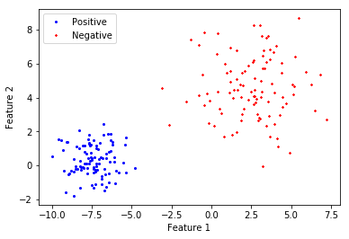
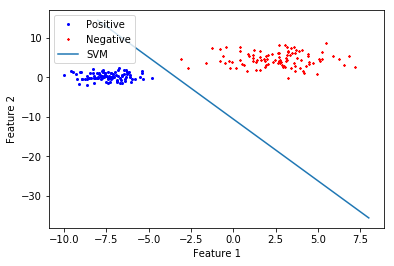
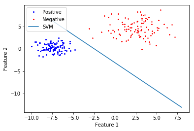
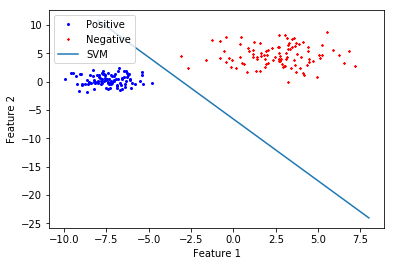
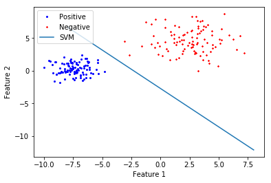

# 机器学习第二次作业

计算机学院+20020129+王悟信+SVM

## 线性分类算法

>考虑超平面$w^Tx+b=0$

>给定$a>0$，要求超平面：

>>1.对于正样本（即$y_i=1$）：$w^Tx_i+b \geq a$

>>2.对于负样本（即$y_i=-1$）：$w^Tx_i+b \leq -a$

>即$y_i(w^Tx_i+b) \geq a \forall i$

样本$x_i$到超平面的距离为：$\frac{w^Tx_i+b}{||w||}=\frac{y_i(w^Tx_i+b)}{||w||}$

样本集$S$到超平面的距离$\rho=min_{(x_i,y_i )\in S}\frac{y_i(w^Tx_I+b)}{||w||}=\frac{a}{||w||}$

优化目标：
$$max_{w,b}\frac{a}{||w||} s.t. y_i(w^Tx_i+b) \geq a, \forall i$$


```python
!pip install cvxopt
```

    Looking in indexes: https://mirror.baidu.com/pypi/simple/
    Collecting cvxopt
    [?25l  Downloading https://mirror.baidu.com/pypi/packages/fc/b8/1ac3cf80380ab8c1e80cd72fd6388778cd7dde988ec84d3f9f4ae0885b49/cvxopt-1.2.5-cp37-cp37m-manylinux1_x86_64.whl (11.6MB)
         |████████████████████████████████| 11.7MB 8.8MB/s eta 0:00:01
    [?25hInstalling collected packages: cvxopt
    Successfully installed cvxopt-1.2.5


首先依旧生成需要进行分类的数据


```python
import numpy as np
import matplotlib.pyplot as plt
%matplotlib inline

# 创建训练样本，设每一类都是100个样本
N = 100

# 生成第一类数据
# 假设数据符合正态分布
class1 = np.random.randn(N, 2)
# 平移数据集
class1 = np.add(class1, [-4,4])

# 生成第二类数据
# 假设数据符合正态分布
class2 = 2*np.random.randn(N, 2)
# 平移数据集
class2 = np.add(class2, [6,8])

# 数据中心化
class_ = np.concatenate((class1, class2),0)
class1 = class1 - np.mean(class_)
class2 = class2 - np.mean(class_)

# 数据可视化
x1 = class1[:, 0].T
y1 = class1[:, 1].T
x2 = class2[:, 0].T
y2 = class2[:, 1].T

plt.plot(x1, y1, "bo", markersize=2, label='Positive')
plt.plot(x2, y2, "r*", markersize=2, label='Negative')
plt.xlabel('Feature 1')
plt.ylabel('Feature 2')
plt.legend(loc = 'upper left')
plt.show()

x = np.concatenate((class1,class2), axis=0)
labels_1 = np.ones(class1.shape[0])
labels_2 = np.ones(class2.shape[0])-2
y = np.concatenate((labels_1,labels_2), axis=0)
```





## SVM算法主体代码

根据PPT中（6）式和（9）式写出SVM算法的代码，特别的，经过数学推导知，（9）式的求解只需在（6）式的基础上增加C的约束即可

通过构造QP问题的格式，带入cvxopt库中进行解算即可求得最终得到w与b


```python
import numpy as np
import matplotlib.pyplot as plt
import cvxopt

class SVM():
    def __init__(self):
        self.threshold = 1e-5
    
    def svm(self, x, y, c=None):
        row, col = x.shape

        H, _, k = kernel(x, y, row)

        H = cvxopt.matrix(H)
        f = cvxopt.matrix(np.ones(row)*-1)

        A = cvxopt.matrix(np.diag(np.ones(row) * -1))
        Aeq = cvxopt.matrix(y, (1, row))
        Beq = cvxopt.matrix(np.zeros(row))
        if c == None:
            b = cvxopt.matrix(0.0)
        else:
            b = cvxopt.matrix(-c)
        
        cvxopt.solvers.options['show_progress'] = False
        alpha = np.ravel(cvxopt.solvers.qp(H,f,A,Beq,Aeq,b)['x'])
        w = np.dot(np.multiply(alpha, y), x)

        counter = 0
        for i in range(len(alpha)):
            if(alpha[i] >= self.threshold):
                counter += 1
                b += y[i] - np.dot(np.multiply(alpha, y), k[i])
        if(counter != 0):
            b = b/counter
        return w, np.float(b)

def kernel(x,y,r):
    H = np.zeros((r,r))
    k = np.zeros((r,r))
    for i in range(r):
        for j in range(r):
            H[i,j] = y[i] * y[j] * np.dot(np.transpose(x[i]), x[j])
            k[i,j] = np.dot(np.transpose(x[i]), x[j])
    return H, H.shape, k
```

## 分别针对留一法与多折验证法进行训练与测试


```python
def train_remain_one(svm, x, y):
    ws = []
    bs = []
    for i in range(len(x)):
        x_train = np.r_[x[:i], x[i+1:]]
        y_train = np.r_[y[:i], y[i+1:]]
        w, b = svm.svm(x_train,y_train)
        ws.append(w)
        bs.append(b)
    return ws, bs
```


```python
def train_remain_one_c(svm, x, y, c):
    ws = []
    bs = []
    for i in range(len(x)):
        x_train = np.r_[x[:i], x[i+1:]]
        y_train = np.r_[y[:i], y[i+1:]]
        w, b = svm.svm(x_train,y_train, c)
        ws.append(w)
        bs.append(b)
    return ws, bs
```


```python
def train_k_split(svm, k, x, y):
    ws = []
    bs = []
    for i in range(k):
        x_train = np.r_[x[:i*len(x)//k], x[(i+1)*len(x)//k:]]
        y_train = np.r_[y[:i*len(y)//k], y[(i+1)*len(y)//k:]]
        w, b = svm.svm(x_train, y_train)
        ws.append(w)
        bs.append(b)
    return ws, bs
```


```python
def train_k_split_c(svm, k, x, y, c):
    ws = []
    bs = []
    for i in range(k):
        x_train = np.r_[x[:i*len(x)//k], x[(i+1)*len(x)//k:]]
        y_train = np.r_[y[:i*len(y)//k], y[(i+1)*len(y)//k:]]
        w, b = svm.svm(x_train, y_train, c)
        ws.append(w)
        bs.append(b)
    return ws, bs
```

### 留一法的测试


```python
def test_one(w, b, x, y):
    counter = 0
    y_final = (np.dot(w, x) + b)[0][0]
    if(np.sign(np.dot(w, x) + b) == y):
        counter += 1
    return counter, y_final
```

### 多折验证的测试


```python
def test(w, b, x, y):
    counter = 0
    y_final = []
    for i in range(len(y)):
        y_final.append((np.dot(w, x[i]) + b)[0][0])
        if(np.sign(np.dot(w, x[i]) + b) == y[i]):
            counter += 1
    return counter/len(y), y_final
```


```python
import time
#用于执行交叉测试

if __name__ == '__main__':
    svm = SVM()
    start = time.time()
    ws_remain_one, bs_remain_one = train_remain_one(svm, x, y)
    costtime = time.time() - start
    print("Time used:", costtime)
    temp_percent_remain_one = []
    for i in range(len(x)):
        percent, y_final = test_one(ws_remain_one[i], bs_remain_one[i], x[i], y[i])
        temp_percent_remain_one.append(percent)
    print('the mean accu for svm mult test is:', np.mean(np.array(temp_percent_remain_one)))
    w_remain_one = np.mean(np.array(ws_remain_one), axis=0)
    b_remain_one = np.mean(np.array(bs_remain_one), axis=0)
    x_ = np.linspace(-8, 8, 2)
    y_ = -(w_remain_one[0]*x_+np.array(b_remain_one).reshape(1))/w_remain_one[1]
    plt.plot(x1, y1, "bo", markersize=2, label='Positive')
    plt.plot(x2, y2, "r*", markersize=2, label='Negative')
    plt.plot(x_, y_, label='SVM')
    plt.xlabel('Feature 1')
    plt.ylabel('Feature 2')
    plt.legend(loc = 'upper left')
    plt.show()

    start = time.time()
    ws_remain_one_c, bs_remain_one_c = train_remain_one_c(svm, x, y, 0.1)
    costtime = time.time() - start
    print("Time used:", costtime)
    temp_percent_remain_one_c = []
    for i in range(len(x)):
        percent, y_final = test_one(ws_remain_one_c[i], bs_remain_one_c[i], x[i], y[i])
        temp_percent_remain_one_c.append(percent)
    print('the mean accu for svm mult test is:', np.mean(np.array(temp_percent_remain_one_c)))
    w_remain_one_c = np.mean(np.array(ws_remain_one_c), axis=0)
    b_remain_one_c = np.mean(np.array(bs_remain_one_c), axis=0)
    x_ = np.linspace(-8, 8, 2)
    y_ = -(w_remain_one_c[0]*x_+np.array(b_remain_one_c).reshape(1))/w_remain_one_c[1]
    plt.plot(x1, y1, "bo", markersize=2, label='Positive')
    plt.plot(x2, y2, "r*", markersize=2, label='Negative')
    plt.plot(x_, y_, label='SVM')
    plt.xlabel('Feature 1')
    plt.ylabel('Feature 2')
    plt.legend(loc = 'upper left')
    plt.show()

    start = time.time()
    k = 5
    ws_k_split, bs_k_split = train_k_split(svm, k, x, y)
    costtime = time.time() - start
    print("Time used:", costtime)
    temp_percent_k_split = []
    for i in range(k):
        percent, y_final = test(ws_k_split[i], bs_k_split[i], 
                            x[i*len(x)//k:(i+1)*len(x)//k], y[i*len(y)//k:(i+1)*len(x)//k])
        temp_percent_k_split.append(percent)
    print('the mean accu for svm mult test is:', np.mean(np.array(temp_percent_k_split)))
    w_k_split = np.mean(np.array(ws_k_split), axis=0)
    b_k_split = np.mean(np.array(bs_k_split), axis=0)
    x_ = np.linspace(-8, 8, 2)
    y_ = -(w_k_split[0]*x_+np.array(b_k_split).reshape(1))/w_k_split[1]
    plt.plot(x1, y1, "bo", markersize=2, label='Positive')
    plt.plot(x2, y2, "r*", markersize=2, label='Negative')
    plt.plot(x_, y_, label='SVM')
    plt.xlabel('Feature 1')
    plt.ylabel('Feature 2')
    plt.legend(loc = 'upper left')
    plt.show()

    start = time.time()
    ws_k_split_c, bs_k_split_c = train_k_split_c(svm, 5, x, y, 0.1)
    costtime = time.time() - start
    print("Time used:", costtime)
    temp_percent_k_split_c = []
    for i in range(k):
        percent, y_final = test(ws_k_split_c[i], bs_k_split_c[i], 
                                    x[i*len(x)//k:(i+1)*len(x)//k], y[i*len(y)//k:(i+1)*len(x)//k])
        temp_percent_k_split_c.append(percent)
    print('the mean accu for svm mult test is:', np.mean(np.array(temp_percent_k_split_c)))
    w_k_split_c = np.mean(np.array(ws_k_split_c), axis=0)
    b_k_split_c = np.mean(np.array(bs_k_split_c), axis=0)
    x_ = np.linspace(-8, 8, 2)
    y_ = -(w_k_split_c[0]*x_+np.array(b_k_split_c).reshape(1))/w_k_split_c[1]
    plt.plot(x1, y1, "bo", markersize=2, label='Positive')
    plt.plot(x2, y2, "r*", markersize=2, label='Negative')
    plt.plot(x_, y_, label='SVM')
    plt.xlabel('Feature 1')
    plt.ylabel('Feature 2')
    plt.legend(loc = 'upper left')
    plt.show()
    
```

    Time used: 34.14529728889465
    the mean accu for svm mult test is: 1.0





    Time used: 32.15938377380371
    the mean accu for svm mult test is: 1.0





    Time used: 0.5100317001342773
    the mean accu for svm mult test is: 1.0





    Time used: 0.4976646900177002
    the mean accu for svm mult test is: 1.0




