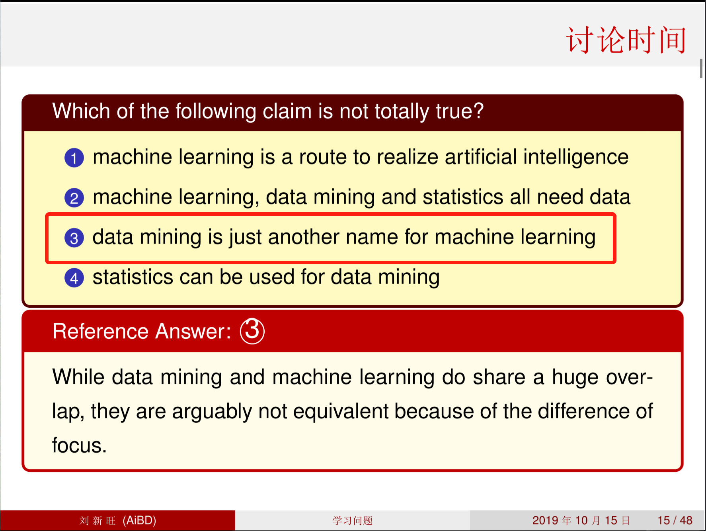
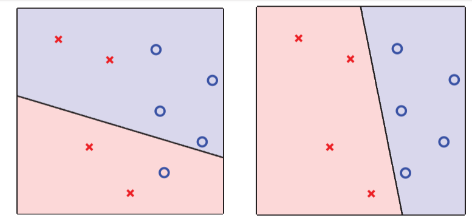
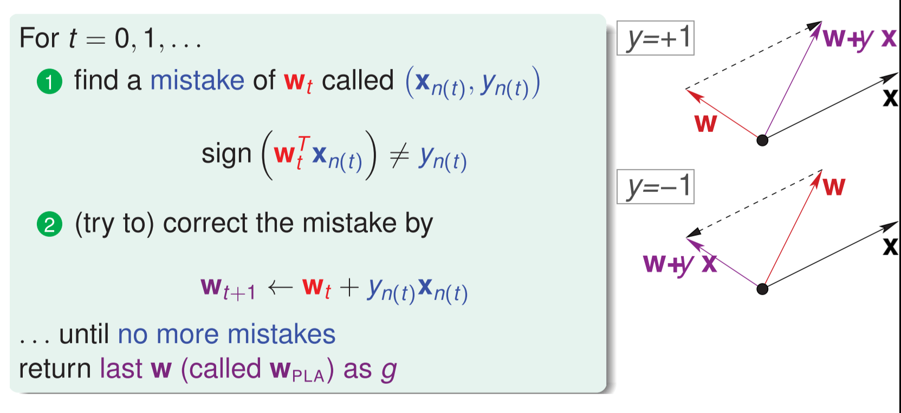
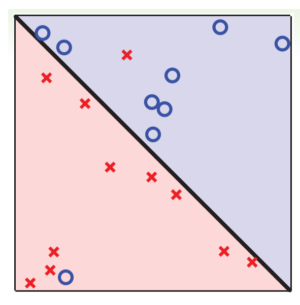
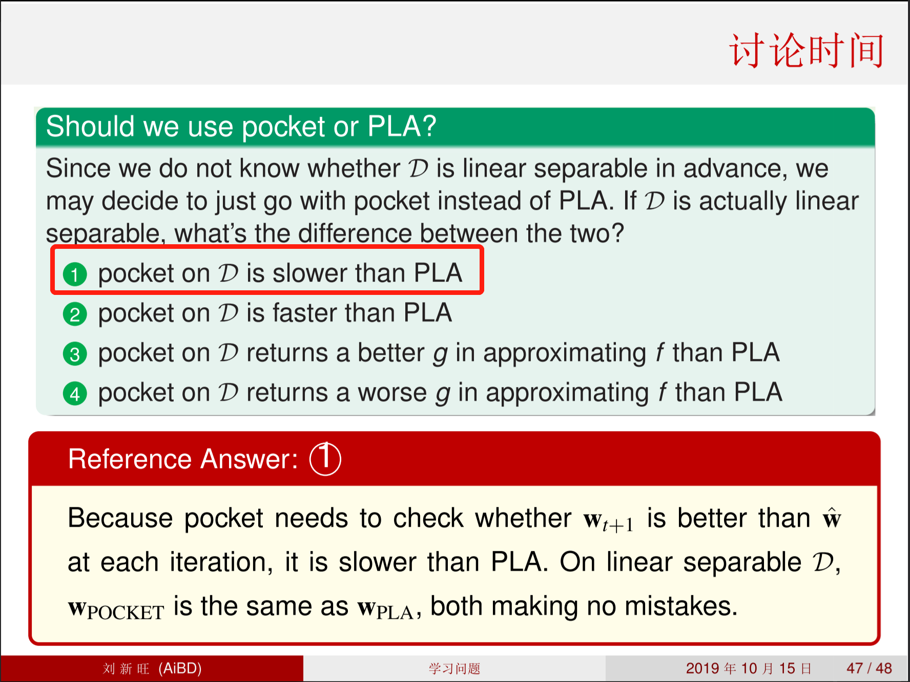

# 第一章 学习问题

[TOC]

## 1.1 学习与机器学习

### 机器学习定义

 通过从==数据==中==获取经验==来==提高性能==


## 1.2 机器学习组成要素及与其他领域的关系

### 学习问题形式化

- 输入：$x \in \mathcal{X}$
- 输出：$y \in \mathcal{Y}$
- 需要学习的未知模式$\Leftrightarrow$目标函数：$f:\mathcal{X} \rightarrow \mathcal{Y}$
- 数据$\Leftrightarrow$训练集：$\mathcal{D}=\{(\pmb{x}_1,y_1),\cdots,(\pmb{x}_N,y_N)\}$
- 假设$\Leftrightarrow$使计算机获得良好性能的能力：$g:\mathcal{X} \rightarrow \mathcal{Y}$


### 学习模型


### 机器学习的实用定义

使用数据来计算一个拟合目标$f$的假设$g$

- 例题：


### 机器学习与数据挖掘、人工智能、统计学的关系

| 机器学习                               | 数据挖掘                       | 人工智能               | 统计学                     |
| -------------------------------------- | ------------------------------ | ---------------------- | -------------------------- |
| 使用数据来计算一个拟合目标$f$的假设$g$ | 使用大量数据来找到感兴趣的属性 | 使计算机能够表现出智能 | 使用数据对未知过程进行推断 |

- 如果感兴趣的属性与目标假设相同，则==机器学习=数据挖掘==
- 如果感兴趣的属性与目标假设相关，则==数据挖掘可以辅助机器学习==
- 传统数据挖掘同时关注==大数据上高性能的计算==
- $g \simeq f$——==机器学习可以实现AI==（机器学习是实现AI的一个途径）
- $g$是推断结果，$f$是未知的——==统计可以用来实现机器学习==
- 传统统计同时关注==具有数学假设的可证明结果==，对计算不怎么关注





## 1.3 感知机假说集及感知机学习算法

### 一类简单的假说集合：“感知机”

- 对于$\pmb{x}=\{x_1,x_2,\cdots,x_d\}$的特征，计算一个权重分数$score$，且

  - 若$\sum\limits^d_{i=1}w_ix_i > threshold$，则判定为正例
  - 若$\sum\limits^d_{i=1}w_ix_i < threshold$，则判定为负例

- $\mathcal{Y}\{+1,-1\}$，线性式$h \in \mathcal{H}$为：
  $$
  h(x)=sign((\sum\limits^d_{i=1}\textcolor{red}{w_i}x_i)-\textcolor{red}{threshold})
  $$

这被称为==感知机==假设

### 感知机假说的向量形式

$$
\begin{align}
h(x) &= sign((\sum\limits^d_{i=1}\textcolor{red}{w_i}x_i)-\textcolor{blue}{threshold}) \\
& = sign((\sum\limits^d_{i=1}\textcolor{red}{w_i}x_i)+\textcolor{blue}{\underbrace{(-threshold)}_{w_0}\cdot\underbrace{(+1)}_{x_0}}) \\
& = sign(\sum\limits^d_\textcolor{blue}{i=0}\textcolor{red}{w_i}x_i) \\
& = sign(\textcolor{red}{\pmb{w}^T}\pmb{x})
\end{align}
$$


### $\mathbb{R}^2$空间中的感知机

$$
h(\pmb{x})=sign(w_0+w_1x_1+w_2x_2)
$$



- 特征$\pmb{x}$：空间中的点
- 标签$y$：$\textcolor{blue}{+1},\textcolor{red}{-1}$
- 假设$h$：平面中的==直线==（或$\mathbb{R}^d$中的超平面）

感知机$\Leftrightarrow$线性（二）分类

### 从$\mathcal{H}$中选择$g$

$\mathcal{H}=$所有可能的感知机，$g=？$

- 目标：$g \simeq f$（$f$未知是很难）
- 可行方案：在$D$上$g \simeq f$，$g(\pmb{x}_n)=f(\pmb{x}_n)=y_n$
- 难点：$\mathcal{H}$无穷多
- 想法：从某个$g_0$开始，不断修正它在$\mathcal{D}$上的结果

### 感知机学习算法

从某个$\pmb{w}_0$开始（通常设为$\pmb{0}$），不断修正它在$\mathcal{D}$上的错误



代码示例：

```python
# 更新参数
def update(self, label_i, data_i):
        tmp = label_i * data_i
        tmp = tmp.reshape(self.w.shape)
        # 更新w和b
        self.w = tmp + self.w
        self.b = self.b + label_i
# 感知机算法
def pla(self):
        isFind = False
        num = 0
        while not isFind:
            count = 0
            for i in range(self.num_samples):
                tmp_y = self.sign(self.w, self.b, self.x[i, :])
                if tmp_y * self.y[i] <= 0:
                    count += 1
                    num += 1
                    self.update(self.y[i], self.x[i, :])
            if count == 0:
                isFind = True
```

### 感知机算法的问题

要将$g$做到在$\mathcal{D}$上无分类错误

- 算法上，要达到收敛
  - 初始循环次数？
  - 随机循环次数？
  - 其他？
- 学习：$g \simeq f$？
  - 在$\mathcal{D}$上，能够收敛
  - 在$\mathcal{D}$之外呢？
  - 如果不能收敛呢？


## 1.4 感知机学习算法的理论保证

### 线性可分性

- 如果PLA收敛，要能找到$\pmb{w}$使得在$\mathcal{D}$无分类错误
- 满足的话，称$\mathcal{D}$==线性可分==
- 

- **假设$\mathcal{D}$线性可分，PLA一定收敛吗？**

  - 线性可分$\Leftrightarrow \exist \pmb{w}_f \quad s.t \quad y_n=sign(\pmb{w}_f^T\pmb{x}_n)$

  - 在更新算法的过程中，每一步都比上一步更好

    需要证明更新后的参数$\pmb{w}_{t+1}$比当前的参数$\pmb{w}_t$更加接近目标参数$\pmb{w}_f$，即需要证明$\pmb{w}_f^T\pmb{w}_{t+1}>\pmb{w}_f^T\pmb{w}_{t}$

    **证明**
    $$
    \begin{align}
    \because y_{n(t)}\pmb{w}_f^T\pmb{x}_{n(t)} &\textcolor{blue}{\geq \min_{n}y_n\pmb{w}_f^T\pmb{x}_n} \textcolor{red}{>0} \\
    \therefore 由更新规则知：\\
    \pmb{w}_t^T\pmb{w}_{t+1}^T &= \pmb{w}_t^T(\pmb{w}_t+\textcolor{blue}{y_{n(t)}\pmb{x}_{n(t)}}) \\
    &\textcolor{blue}{\geq} \pmb{w}_f^T\pmb{w}_t \textcolor{blue}{+\min_n y_n\pmb{w}_f^T\pmb{x}_n} \\
    &\textcolor{red}{>}\pmb{w}_f^T\pmb{w}_t\textcolor{red}{+0}
    \end{align}
    $$
    得证

  - 以上证明内容并不能保证是$\pmb{w}_t$与$\pmb{w}_f$角度更一致，故需要证明$\pmb{w}_{t}$的模长并不会太大，由于$\pmb{w}_t$只在发生错误的时候按照更新规则$sign(\pmb{w}_t^T\pmb{x}_{n(t)}) \neq y_{n(t)} \Leftrightarrow \textcolor{blue}{y_{n(t)}\pmb{w}_t^T\pmb{x}_{n(tt)}\leq0}$改变，所以错误的分类限制了$\textcolor{blue}{\|\pmb{w}_t\|^2}$的增长，需要证明每一步的增长都有上界

    **证明**
    $$
    \begin{align}
    \|\pmb{w}_{t+1}\|^2 &= \|\pmb{w}_t+y_{n(t)}\pmb{x}_{n(t)}\|^2 \\
    &= \|\pmb{w}_t\|^2+\textcolor{blue}{2y_{n(t)}\pmb{w}_t^T\pmb{x}_{n(t)}}+\|y_{n(t)}\pmb{x}_{n(t)}\|^2 \\
    &\leq \|\pmb{w}_t\|^2+\textcolor{blue}{0}+\textcolor{red}{\|y_{n(t)}\pmb{x}_{n(t)}\|^2} \\
    &\leq \|\pmb{w}_t\|^2+\textcolor{red}{\|y_n\pmb{x}_n\|^2}
    \end{align}
    $$
    则每一步的增长都有上界

  - 上面两步可以从直觉上表明PLA可以收敛，下面给出更严格的证明

  - **Novikoff定理** [^1] 设训练数据集$T=\{(x_1,y_1),(x_2,y_2),\cdots,(x_N,y_N),\}$是线性可分的，其中$x_i \in \mathcal{X}=\pmb{R}^n,y_i=\{-1,+1\},i=1,2,\cdots,N$，记$\pmb{\hat{w}}=(\pmb{w}^T,b)^T$，$\pmb{\hat{x}}=(\pmb{x},1)^T$，则$\pmb{\hat{x}},\pmb{\hat{w}} \in \pmb{R}^{n+1}$，显然$\pmb{\hat{w}}\cdot\pmb{\hat{x}}=\pmb{w}\cdot\pmb{x}+b$

    - 存在满足条件$\|\pmb{\hat{w}}_{opt}\|=1$的超平面$\pmb{\hat{w}}_{opt}\cdot\pmb{\hat{x}}=\pmb{w}_{opt}\cdot\pmb{x}+b_{opt}=0$将数据集完全正确分开，且存在$\gamma > 0$，对所有$i=1,2,\cdots,N$
      $$
      y_I(\pmb{\hat{w}}\cdot\hat{x}_i)=y_i(\pmb{w}_{opt}\cdot x_i+b_{opt}) \geq \gamma
      $$

    - 令$R=\max\limits_{1 \leq i \leq N}\|\pmb{\hat{x}}\|$，则感知机算法在训练数据集上的误分类次数$k$满足不等式
      $$
      k \leq (\frac{R}{\gamma})^2
      $$
      **证明**

      - 由于训练数据是线性可分的，故存在超平面可将数据集完全正确分开，取此超平面为$\pmb{\hat{w}}_{opt}\cdot\pmb{\hat{x}}=\pmb{w}_{opt}\cdot\pmb{x}+b_{opt}=0$，使$\|\pmb{\hat{w}}_{opt}\|=1$，由于对有限的$i=1,2,\cdots,N$，均有
        $$
        y_i(\pmb{\hat{w}}_{opt}\cdot \hat{x}_i)=y_i(\pmb{w}_{opt}\cdot x_i+b_{opt}) > 0
        $$
        所以存在
        $$
        \gamma = \min_i\{y_i(w_{opt}\cdot x_i+b_{opt})\}
        $$
        使
        $$
        y_I(\pmb{\hat{w}}\cdot\hat{x}_i)=y_i(\pmb{w}_{opt}\cdot x_i+b_{opt}) \geq \gamma \label{20}
        $$

      - 感知机算法从$\pmb{\hat{w}}_0=0$开始，如果示例被误分类，则更新权重。令$\hat{\pmb{w}}_{k-1}$是第$k$个误分类实例之前的扩充权重向量，即
        $$
        \pmb{\hat{w}}_{k-1}=(\pmb{w}_{k-1}^T,b_{k-1})^T
        $$
        则第$k$个误分类实例的条件是
        $$
        y_i(\pmb{\hat{w}}_{k-1}\cdot\pmb{\hat{x}}_i)=y_i(\pmb{w}_{k-1}\cdot \pmb{x}_i+b_{k-1}) \leq 0 \label{22}
        $$
        则此时进行更新
        $$
        \begin{align}
        \pmb{w}_k &\leftarrow \pmb{w}_{k-1}+\eta y_i x_i \\
        b_k &\leftarrow b_{k-1}+\eta y_i
        \end{align}
        $$
        即
        $$
        \pmb{\hat{w}}_k=\pmb{\hat{w}}_{k-1}+\eta y_i\pmb{\hat{x}}_i \label{25}
        $$
        下面证明两个不等式

        - $$
          \pmb{\hat{w}}_k\cdot\pmb{\hat{w}}_{opt} \geq k\eta\gamma \label{26}
          $$

          由$\ref{25}$及$\ref{20}$可知
          $$
          \begin{align}
          \pmb{\hat{w}}_k\cdot\pmb{\hat{w}}_{opt} &= \pmb{\hat{w}}_{k-1}\cdot\pmb{\hat{w}}_{opt}+\eta y_i\pmb{\hat{w}}_{opt}\cdot\pmb{\hat{x}}_i \\
          &\geq \pmb{\hat{w}}_{k-1}\cdot\pmb{\hat{w}}_{opt}+\eta\gamma
          \end{align}
          $$
          由此递推即可证得$\ref{26}$

        - $$
          \|\pmb{\hat{w}}_k\|^2 \leq k\eta^2R^2 \label{29}
          $$

          由式$\ref{25}$及$\ref{22}$可得
          $$
          \begin{align}
          \|\pmb{\hat{w}}_k\|^2 &= \|\pmb{\hat{w}}_{k-1}\|^2+2\eta y_i \pmb{\hat{w}}_{k-1}\cdot\hat{x}_i+\eta^2\|\hat{\pmb{x}}_i\|^2\\
          &\leq \|\pmb{\hat{w}}_{k-1}\|^2+\eta^2\|\hat{\pmb{x}}_i\|^2\\
          &\leq \|\pmb{\hat{w}}_{k-1}\|^2+\eta^2R^2 \\
          &\leq \|\pmb{\hat{w}}_{k-2}\|^2+2\eta^2R^2 \\
          &\quad\quad\quad\vdots \\
          &\leq k\eta^2R^2
          \end{align}
          $$
          结合不等式$\ref{26}$及不等式$\ref{29}$即可证得
          $$
          k\eta\gamma \leq \pmb{\hat{w}}_k\cdot\pmb{\hat{w}}_{opt}\leq\|\pmb{\hat{w}}_k\|\|\pmb{\hat{w}}_{opt}\|\leq \sqrt{k}\eta R \\
          \Rightarrow k^2\gamma^2 \leq kR^2 \\
          \Rightarrow k \leq (\frac{R}{\gamma})^2
          $$

        

  ### PLA的其他信息

  - $\langle \pmb{w}_f,\pmb{w}_t \rangle$增长迅速，$\pmb{w}_t$的长度增长缓慢
- PLA算法实现简单，对于任何维度$d$的线性可分数据都有效
  - 实际上$\mathcal{D}$是否线性可分提前不知道
  - 不能完全确定需要多久才能收敛，$\gamma$依赖于$\pmb{w}_k$（谱半径）

## 1.5 非可分数据

### 噪声数据学习


### 容忍噪声的线性分类器



要满足$y_n=f(x)$是不能直接线性分割

### Pocket算法

将PLA算法改进为将当前最佳权重存在pocket中

```python
def update(self, label_i, data_i):
        tmp = label_i * data_i
        # 更新w和b
        tmp_w = tmp.reshape(self.w.shape) + self.w
        tmp_b = self.b + label_i
        if len(self.classify(tmp_w, tmp_b)) <= len(self.classify(self.w, self.b)):
            self.best_w = tmp_w
            self.best_b = tmp_b
        self.w = tmp_w
        self.b = tmp_b

    def classify(self, w, b):
        mistakes = []
        for i in range(self.num_samples):
            tmp_y = self.sign(w, b, self.x[i, :])
            if tmp_y * self.y[i] <= 0:
                mistakes.append(i)
        return mistakes

    def pocket(self):
        iters = 0
        isFind = False
        while not isFind:                
            iters += 1
            mistakes = self.classify(self.w, self.b)
            if len(mistakes) == 0:
                break
            elif len(mistakes) > 1:
                i = mistakes[np.random.randint(0, len(mistakes)-1)]
            else:
                i = 0
            update = self.update(self.y[i], self.x[i, :])
            if iters == self.max_iters:
                isFind = True
        print("Pocket totally iter:", iters)
        return self.best_w, self.best_b
```



## 总结

- 感知机假设集：在$\mathbb{R}^d$中将数据分开的超平面
- PLA算法：在改正分类错误的过程中提高性能
- PLA算法停下来的条件：所有的数据都被正确分类
- 线性不可分数据：将最佳权重保存下来对比更新

[^1]:李航. 统计学习方法 第2版[M]. 清华大学出版社, 2019.


