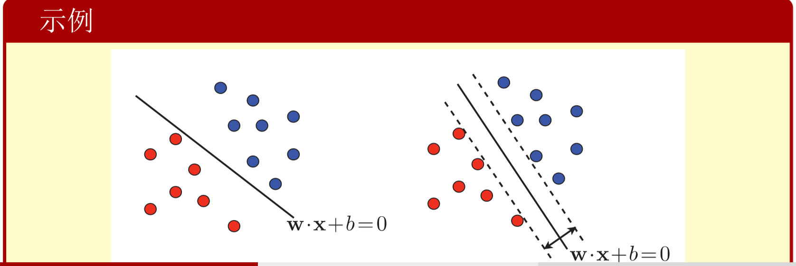
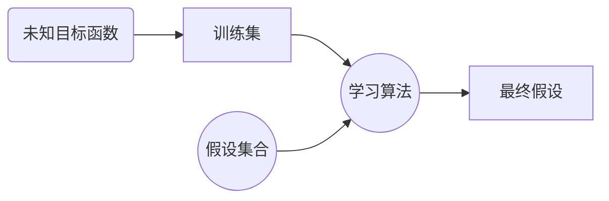
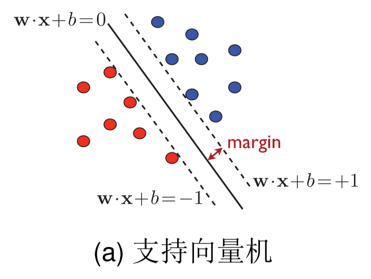
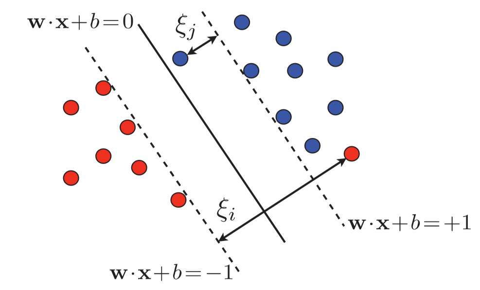
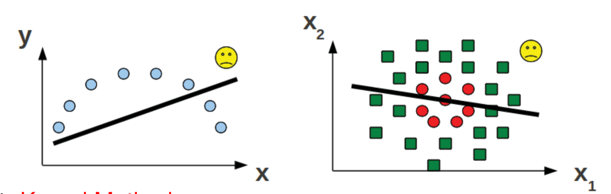

# 第二章 支持向量机与核算法

[TOC]

## 2.1 线性分类

### 基本符号

- $\mathcal{X} \in \mathbb{R}^d$：==输入空间==
- $\mathcal{Y} = \{-1,+1\}$：==输出空间==
- $f:\mathcal{X} \mapsto \mathcal{Y}$：==未知的目标函数==
- $S = \{(\pmb{x}_i,_i)\}_{i=1}^n$其中$\y_i=f(\pmb{x}_i)$，$\{\pmb{x}_i\}_{i=1}^n$从输入空间$X$中依据某个分布$D$采集得到：==训练集合==
- $\mathcal{H}=\{\pmb{x} \mapsto sig(\pmb{w}^T\pmb{x}+b):\pmb{w} \in \mathbb{R}^d,b \in \mathbb{R}\}$：==假说集合==
- $R_S(h)=\frac{1}{n}\sum\limits^n_{i=1}[h(\pmb{x}_i) \neq f(\pmb{x}_i)],h \in \mathcal{H}$：==经验误差==
- $R_D(h)=Pr_{\pmb{X} \sim D}[h(\pmb{x}) \neq f(\pmb{x})],h \in \mathcal{H}$：==泛化误差==

### 分类问题

**二分类问题形式化定义**：

给定训练样本集合$\textcolor{blue}{S=\{(\pmb{x}_1,y_1),\cdots,(\pmb{x}_n,y_n)\}}$，其中$\{\pmb{x}_i\}_{i=1}^n \subseteq \mathcal{X}^n$独立同分布，$y_i=\textcolor{blue}{f(\pmb{x}_i)} \in \mathcal{Y}(\forall i=1,\cdots,n)$。二分类问题的目标是基于数据$\textcolor{blue}{S}$，从假说集合$\mathcal{H}$中选择一个假说$h$，以使得==期望误差==
$$
E_{\pmb{x} \sim D}[h(\pmb{x} \neq f(\pmb{x}))]
$$
最小

其中
$$
\begin{align}
E_{\pmb{x} \sim D}[h(\pmb{x} \neq f(\pmb{x}))] &= 1 \cdot Pr_{\pmb{X} \sim D}(h(\pmb{x}) \neq f(\pmb{x}))+0 \cdot Pr_{\pmb{X} \sim D}(h(\pmb{x}) = f(\pmb{x})) \\
&= Pr_{\pmb{X} \sim D}(h(\pmb{x}) \sim f(\pmb{x}))
\end{align}
$$

### 学习一个分类器

==假说集（线性）==
$$
\mathcal{H}=\{\pmb{x} \mapsto sign(\pmb{w}^T\pmb{x}+b):\pmb{w} \in \mathbb{R}^d,b \in \mathbb{R} \}
$$
==学习算法==

$\mathcal{A}$：支持向量机（Support Vector Machines, SVMs）

## 2.2 支持向量机

### 线性分类算法

- 考虑超平面$\pmb{w}^T\pmb{x}+b=0$

- 给定$a>0$，要求该超平面满足

  - 对于正样本（即$y_i=1$）
    $$
    \pmb{w}^T\pmb{x}_i+b \geq a
    $$

  - 对于负样本（即$y_i=-1$）
    $$
    \pmb{w}^T\pmb{x}_i+b \leq a
    $$

  - 即$y_i(\pmb{w}^T\pmb{x}_i+b \geq a) \forall i$

**定义**（几何间隔）

样本$\pmb{x}_i$到超平面$\pmb{w}^T\pmb{x}+b=0$的几何距离：$\frac{|\pmb{w}^T\pmb{x}_i+b|}{\|\pmb{w}\|}=\frac{y_i(\pmb{w}_i\pmb{x}_i+b)}{\|\pmb{w}\|}$

样本集$S$到超平面$\pmb{w}^T\pmb{x}_i+b=0$的几何距离$\rho$被定义为：
$$
\rho=\min_{(\pmb{x}_i,y_i) \in S} \frac{y_i(\pmb{w}^T\pmb{x}_i+b)}{\|\pmb{w}\|}=\frac{a}{\|\pmb{w}\|}
$$

#### 算法推导

##### 间隔最大化

> 支持向量机学习的基本想法是求解能够正确划分训练集并且几何间隔最大的分离超平面，对线性可分的训练集而言，线性可分分离超平面有无穷个（等价于感知机），但是==几何间隔最大的分离超平面是唯一的==。这里的间隔最大化又称为**硬间隔最大化**。
>
> 间隔最大化的直观解释是：对训练数据集找到几个间隔最大的超平面意味着以充分大的确信度对训练集进行分类。也就是说，==不仅将正负实例分开，而且对最难的实例（离超平面最近的点）也能够又足够大的确信度将它们分开==。[^1]

##### 最大间隔分离超平面

考虑如何求一个==几何间隔最大==的分离超平面，即最大间隔分离超平面，其可以表示为以下的约束最优化问题：
$$
\begin{align}
&\max_{\pmb{w},b} \rho=\frac{a}{\|\pmb{w}\|} \\
&s.t. \quad y_i(\pmb{w}_i^T\pmb{x}_i+b) \geq a,\forall i
\end{align}
$$
即希望最大化超平面$(\pmb{w},b)$关于训练数据集的几何间隔$\rho$，==约束条件表示的是超平面$(\pmb{w}_i,b)$关于每个训练样本点的几何间隔至少是$a$==。

==函数间隔$a$的取值并不影响最优化问题的解==。事实上，假设将$\pmb{w}$和$b$按比例改变为$\lambda \pmb{w}$和$\lambda b$，函数间隔的这一改变对上面最优化问题的不等式约束以及对目标函数的优化也没有影响。于是取$a=1$，令$\pmb{\hat{w}}=\frac{\pmb{w}}{a},\hat{b}=\frac{b}{a}$，则优化目标等价于
$$
\begin{align}
&\max_{\pmb{\hat{w}},\hat{b}} \frac{1}{\|\pmb{\hat{w}}\|} \\
&s.t.\quad y_i(\pmb{\hat{w}}^T\pmb{x}_i+\hat{b}) \geq 1,\forall i
\end{align}
$$
注意到==最大化$\frac{1}{\|\pmb{\hat{w}}\|}$与最小化$\frac{1}{2}\|\pmb{\hat{w}}\|^2$等价==，故优化问题等价于
$$
\begin{align}
&\min_{\pmb{\hat{w}},\hat{b}} \frac{1}{2}\|\pmb{\hat{w}}\|^2 \\
&s.t.\quad y_i(\pmb{\hat{w}}^T\pmb{x}_i+\hat{b}) \geq 1,\forall i
\end{align}
$$
这是一个凸二次规划问题。

>凸优化问题指的是约束最优化问题
>$$
>\begin{align}
>&\min_{\pmb{w}} f(\pmb{w}) \\
>&s.t.\quad g_i(\pmb{w}) \leq 0, \quad i=1,2,\cdots,k\\
>&\quad\quad~~~ h_j(\pmb{w}) = 0, i=1,2,\cdots,l
>\end{align}
>$$
>其中，目标函数$f(\pmb{w})$和约束函数$g_i(\pmb{w})$都是$\pmb{R}^n$上的连续可微凸函数，约束函数$h_i(\pmb{w})$是$\pmb{R}^n$上的仿射函数。[^1][^2]

##### 最大间隔分离超平面的存在唯一性

> **定理**[^1]：若训练集$T$线性可分，则可将训练集中的样本点完全正确分开的最大间隔分离超平面存在且唯一
>
> **证明**：
>
> - 存在性
>
>   由于训练数据集==线性可分==，则最优化问题==一定存在可行解==[^3]。又由于目标函数==有下界==$0$，故最优化问题==必有解==，记作$(\pmb{w}^*,b^*)$。由于训练数据集中既有正类又有负类，则$(\pmb{w},b)=(0,b)$不是最优化的可行解（不满足约束条件），因而最优解$(\pmb{w}^*,b^*)$必满足==$\pmb{w}^* \neq 0$==。因此得知分离超平面的存在性。
>
> - 唯一性
>
>   首先证明最优化问题解中$\pmb{w}^*$的唯一性。假设存在两个最优解$(\pmb{w}_1^*,b_1^*)$与$(\pmb{w}_2^*,b_2^*)$，==显然$\|\pmb{w}_1^*\|=\|\pmb{w}_2^*\|=c$==，其中$c$是一个常数。令$\pmb{w}=\frac{\pmb{w}_1^*+\pmb{w}_2^*}{2},b=\frac{b_1^*+b_2^*}{2}$，则$(\pmb{w},b)$为算法的一个可行解，从而
>   $$
>   c \leq \|\pmb{w}\| \leq \frac{1}{2}\|\pmb{w}_1^*\|+\frac{1}{2}\|\pmb{w}_2^*\|=c
>   $$
>   这表明$\|\pmb{w}\|=\frac{1}{2}\|\pmb{w}_1^*\|+\frac{1}{2}\|\pmb{w}_2^*\|$，从而$\pmb{w}_1^*=\lambda \pmb{w}_2^*$，其中$|\lambda|=1$，若$\lambda=-1$，则$\pmb{w}$不是最优化问题的可行解，矛盾，因此$\lambda=1$，即
>   $$
>   \pmb{w}_1^* = \pmb{w}_2^*
>   $$
>   由此可以把两个最优解分别写成$(\pmb{w},b_1^*)$与$(\pmb{w},b_2^*)$，下面证明$b_1^*=b_2^*$
>
>   设$x_1',x_2'$分别是集合$\{x_i|y_i=+1\}$中分别对应于$(\pmb{w},b_1^*)$与$(\pmb{w},b_2^*)$使得问题不等式中等号成立的点，$x_1'',x_2''$分别是是集合$\{x_i|y_i=-1\}$中分别对应于$(\pmb{w},b_1^*)$与$(\pmb{w},b_2^*)$使得问题不等式中等号成立的点，则由$b_1*=\frac{1}{2}(\pmb{w}^* \cdot x_1'+\pmb{w}^* \cdot x_1''),b_2*=\frac{1}{2}(\pmb{w}^* \cdot x_2'+\pmb{w}^* \cdot x_2'')$可得
>   $$
>   \begin{align}
>   &b_1^*-b_2^*=\frac{1}{2}[\pmb{w}^*(x_1''-x_2'')+\pmb{w}^*(x_1''-x_2'')] \\
>   \because \\
>   &\pmb{w}^* \cdot x_2'+b_1^* \geq q = \pmb{w}^* \cdot x_1'+b_1^* \\
>   &\pmb{w}^* \cdot x_1'+b_2^* \geq q = \pmb{w}^* \cdot x_2'+b_2^* \\
>   \end{align}
>   $$
>   故$\pmb{w}^*(x_1'-x_2')=0$，同理$\pmb{w}^*(x_1''-x_2'')=0$，故$b_1^*=b2^*$
>
>   则两个最优解相同，故唯一性得证
>
> - 验证
>
>   由训练集线性可分得知：分离超平面可以将训练数据集中两类点完全正确分开

#### 求解算法

##### 对偶问题

由==附录==可知，可以将原始问题转化为对偶问题

首先列出Lagrange函数
$$
L(\hat{\pmb{w}},\hat{b};\pmb{\alpha})=\frac{1}{2}\|\hat{\pmb{w}}\|^2-\sum\limits_{i=1}^n\alpha_i(y_i(\hat{\pmb{w}}^T\pmb{x}_i+\hat{b})-1)
$$
其中$\pmb{\alpha}=[\alpha_1,\alpha_2,\cdots,\alpha_n]^T,\alpha_i \geq 0~\forall i$为Lagrange乘子

对应的KKT条件为
$$
\begin{align}
\begin{cases}
\nabla_{\hat{\pmb{w}}}L=\hat{\pmb{w}}-\sum\limits^n_{i=1}\alpha_iy_i\pmb{x}_i=0 & \Rightarrow \hat{\pmb{w}}=\sum\limits^n_{i=1}\alpha_iy_i\pmb{x}_i \\
\nabla_{\hat{b}}L = -\sum\limits^n_{i=1}\alpha_iy_i=0 &\Rightarrow \sum\limits^n_{i=1}\alpha_iy_i=0 \\
\forall i~\alpha_i(y_i(\hat{\pmb{w}}^T\pmb{x}_i+\hat{b})-1)=0 &\Rightarrow \alpha_i \or y_i(\hat{\pmb{w}}^T\pmb{x}_i+\hat{b})=1
\end{cases}
\end{align} \label{24}
$$
将KKT条件代入可得
$$
\min_{\hat{\pmb{w}},\hat{b}}L(\hat{\pmb{w}},\hat{b};\pmb{\alpha})=-\frac{1}{2}\sum\limits^n_{i=1}\sum\limits^n_{j=1}\alpha_i\alpha_jy_iy_j\textcolor{red}{(\pmb{x}_i^T\pmb{x}_j)}+\sum\limits^n_{i=1}\alpha_i
$$
则对偶问题为
$$
\begin{align}
&\min_{\pmb{\alpha}}\frac{1}{2}\sum\limits^n_{i=1}\sum\limits^n_{j=1}\alpha_i\alpha_jy_iy_j\textcolor{red}{(\pmb{x}_i^T\pmb{x}_j)}-\sum\limits^n_{i=1}\alpha_i \label{26}\\
&s.t. ~ \sum\limits^n_{i=1}\alpha_iy_i=0 \label{27}\\ 
&\quad\quad \alpha_i \geq 0,\forall i \label{28}
\end{align}
$$
这是一个标准的带约束二次规划问题

##### 解的形式

**定理**：设$\pmb{\alpha}^*=(\alpha_1^*,\alpha_2^*,\dots,\alpha_l^*)^T$是对偶最优化问题$\ref{26},\ref{27},\ref{28}$的解，则存在下标$j$，使得$\alpha_j^* > 0$，并可按下式求得原始最优化问题的解$\pmb{w}^*,b^*$
$$
\begin{align}
\pmb{w}^* &= \sum\limits^n_{i=1}\alpha_i^*y_i\pmb{x}_i \label{29}\\
b^* &= y_j-\sum\limits^n_{i=1}\alpha_i^*y_i(\pmb{x}_i^T \cdot \pmb{x}_j)
\end{align}
$$
**证明**

由$\ref{24}$可知
$$
\pmb{w}^* = \sum_i\alpha_i^*y_i\pmb{x}_i
$$
其中至少由一个$\alpha_j>0$（用反证法，由$\ref{24}$可知$\pmb{w}^*=\pmb{0}$，矛盾），由此$j$有
$$
y_j((\pmb{w}^*)^T \cdot \pmb{x}_j+b^*)-1=0 \label{32}
$$
将$\ref{29}$代入$\ref{32}$并由$y_j^2=1$可得
$$
b^* = y_j-\sum\limits^n_{i=1}\alpha_i^*y_i\textcolor{red}{(\pmb{x}_i^T \cdot \pmb{x}_j)}
$$
由此定理可知，分离超平面可写成
$$
\sum\limits^n_{i=1}\alpha^*_iy_i(\pmb{x}^T\cdot\pmb{x}_i)+
b^* = 0
$$
分类决策函数可写为
$$
f(x) = sign(\sum\limits^n_{i=1}(\pmb{w}^*)^T\pmb{x}+b^*)=sign(\sum\limits^n_{i=1}\alpha^*_iy_i(\pmb{x}^T\cdot\pmb{x}_i)+
b^*)
$$

##### 说明

- 支持向量（Support Vectors）：对应于$\alpha_i \geq 0$的样本
- 样本总是成对出现的

### 线性不可分

在绝大多数应用中，训练数据并非线性可分，即对任意超平面$\pmb{w}^T\pmb{X}+b$，存在$\pmb{x}_i \in S$，使得
$$
y_i(\pmb{w}^T\pmb{x}_I+b) \ngeq 1
$$

- 超平面错误分类$\pmb{x}_i$
- 超平面正确分类$\pmb{x}_j$，但间隔小于1

#### 非线性可分——优化目标

考虑如下两个相互矛盾的因素

- 间距最大化
- 训练误差最小化

为了将支持向量机算法拓展到可以适应不可分问题，需要修改硬间隔最大化，使其成为软间隔最大化，即对每个样本点引进一个松弛变量$\xi_i \geq 0$，使函数间隔加上松弛变量大于等于1。这压根，约束条件变为
$$
y_i(\pmb{w}^T\pmb{x}_i+b) \geq 1- \xi_i
$$
同时，对每个松弛变量，支付一个代价$C$

则新的学习问题变为
$$
\begin{align}
&\min_{\hat{\pmb{w}},\hat{b},\pmb{\xi}} \frac{1}{2}\|\hat{\pmb{w}}\|^2+\textcolor{red}{C}\sum\limits^n_{i=1}\xi_i  \label{38} \\
&s.t. \quad y_I(\hat{\pmb{w}}^T\pmb{x}_i+\hat{b}) \geq 1-\xi+i \\
&\quad\quad~~~\xi_i \geq 0, \forall i
\end{align}
$$

- 允许训练过程中有误差
- $C$为正则化参数——调节模型复杂度与训练误差

#### Lagerange函数

$$
L(\hat{\pmb{w}},\hat{b},\pmb{\xi};\pmb{\alpha},\pmb{\beta})=\frac{1}{2}\|\hat{\pmb{w}}\|^2+C\sum\limits^n_{i=1}\xi_i-\sum\limits^n_{i=1}\alpha_i(y_i(\hat{\pmb{w}}^T\pmb{x}_i+\hat{b})-1+\xi_i)-\sum\limits^n_{i=1}\beta_i\xi_i
$$

其中$\pmb{\alpha}=[\alpha_1,\cdots,\alpha_n]^T,\pmb{\beta}=[\beta_1,\cdots,\beta_n]^T$为Lagrange乘子

其KKT条件为
$$
\begin{align}
\begin{cases}
\nabla_{\hat{\pmb{w}}}L=\hat{\pmb{w}}-\sum\limits^n_{i=1}\alpha_iy_i\pmb{x}_i = 0&\Rightarrow \hat{\pmb{w}}=\sum\limits^n_{i=1}\alpha_iy_i\pmb{x}_i \\
\nabla_{\hat{b}}L=-\sum\limits^n_{i=1}\alpha_iy_i=0&\Rightarrow \sum\limits^n_{i=1}\alpha_iy_i=0 \\
\nabla_{\pmb{\xi}_i}L=C-\alpha_i-\beta_i & \Rightarrow \alpha_i+\beta_i = C \\
\forall i\quad\alpha_i(y_i(\hat{\pmb{w}}^T\pmb{x}_i+\hat{b})-1+\xi_i) = 0 &\Rightarrow \alpha_i \or y_i(\hat{\pmb{w}}^T\pmb{x}_i+\hat{b}) = 1-\xi_i \\
\forall i \beta_i\xi_i = 0 &\Rightarrow \beta_i = 0\or \xi_i=0
\end{cases}
\end{align} \label{42}
$$

#### 学习的对偶算法

将$\ref{42}$代入$\ref{38}$可得
$$
\begin{align}
&\min_{\pmb{\alpha}}\frac{1}{2}\sum\limits^n_{i=1}\sum\limits^n_{j=1}\alpha_i\alpha_jy_iy_j(\pmb{x}_i^T\pmb{x}_j)-\sum\limits^n_{i=1}\alpha_i \label{43} \\
&s.t. \quad \sum\limits^n_{i=1}\alpha_iy_i=0,\textcolor{red}{C \geq \alpha_i}\geq0,\forall i \label{44}
\end{align}
$$

##### 解的形式

**定理**：设$\pmb{\alpha}^*=(\alpha_1^*,\cdots,\alpha_n^*)^T$是对偶问题$\ref{43},\ref{44}$的一个解，若存在$\pmb{\alpha}^*$的一个分量$\alpha_j^*,0<\alpha_j^*<C$，则原始问题的解$\pmb{w}^*,b^*$可按下式求得：
$$
\begin{align}
\pmb{w}^* &= \sum\limits^n_{i=1}\alpha_i^*y_i\pmb{x}_i \\
b^* &= y_i-\sum\limits^n_{i=1}y_i\alpha_i^*(\pmb{x}_i^T\pmb{x}_j)
\end{align}
$$
**证明**

由KKT条件可知
$$
\hat{\pmb{w}}=\sum\limits^n_{i=1}\alpha_iy_i\pmb{x}_i
$$
若存在$\pmb{\alpha}^*$的一个分量$\alpha_j^*,0<\alpha_j^*<C$

则
$$
y_j((\pmb{w}^*)^T\pmb{x}_j+\hat{b}) = 1-\xi_j \\
\beta_j^* > C-\alpha_j^*
$$
则
$$
\xi_j=0
$$
故
$$
y_j((\pmb{w}^*)^T\pmb{x}_j+\hat{b}) = 1
$$
证毕

由此定理可知，分离超平面可写成
$$
\sum\limits^n_{i=1}\alpha_i^*y_i(\pmb{x}^T\pmb{x}_i)+b^*=0
$$
分类决策函数可写成
$$
f(x) = sign(\sum\limits^n_{i=1}\alpha_i^*y_i(\pmb{x}^T\pmb{x}_i)+b^*)
$$

### 参数选择

留一法与k折验证

[参考](https://www.kaggle.com/getting-started/169813)

## 2.3 总结

- 支持向量机推导
- 拉格朗日对偶式求解
- 参数选择

### 线性支持向量机优缺点

- 优点：

  - 算法简单、只管、可理解性强

- 缺点：表达能力有限，==无法捕获数据间的非线性模式==

  - 输入——输出不再是线性关系
  - 类与类之间不能通过线性边界来划分

  

## 附录 拉格朗日对偶性[^1]

在约束最优化问题中，常利用==拉格朗日对偶性（Lagrange duality）==将原始问题转化为对偶问题，通过==解对偶问题而得到原始问题得解==。

### 原始问题

假设$f(x),c_i(x),h_j(x)$是定义在$\pmb{R}^n$上得连续可微函数，考虑约束最优化问题
$$
\begin{align}
&\min_{x \in \pmb{R}^n}f(\pmb{x}) \\
&s.t. \quad c_i(\pmb{x}) \leq 0,i=1,2,\cdots,k \\
&\quad\quad~~h_j(\pmb{x}) = 0, j=1,2,\cdots,l
\end{align}
$$
称此约束最优化问题为原始最优化问题或原始问题

首先，引进==广义拉格朗日函数（generalized Lagrange function）==
$$
L(\pmb{x},\pmb{\alpha},\pmb{\beta})=f(\pmb{x})+\sum\limits^k_{i=1}\alpha_ic_i(\pmb{x})+\sum\limits^l_{j=1}\beta_jh_j(\pmb{x})
$$
这里$\pmb{x} = [x^{(1)},x^{(2)},\cdots,x^{(n)}]^T \in \pmb{R}^n$，$\alpha_i,\beta_j$是拉格朗日乘子，$\alpha_i \geq 0$。考虑$\pmb{x}$得函数
$$
\theta_P(\pmb{x}) = \max_{\pmb{\alpha},\pmb{\beta}:\alpha_i \geq 0}L(\pmb{x},\pmb{\alpha},\pmb{\beta}) \label{47}
$$
其中下标$P$表示原始问题。

如果$\pmb{x}$满足原始问题的约束条件，则$\theta_P(\pmb{x})=f(\pmb{x})$，而若$\pmb{x}$不满足原始问题约束，则可取对应的$\alpha_i=+\infty$，则$\theta_P(\pmb{x})=+\infty$，或取$\beta_j$满足$\beta_jh_j \rightarrow +\infty$，其余$\alpha_i=\beta_j=0$，则$\theta_P(\pmb{x})=+\infty$

所以如果考虑极小化问题
$$
\min_{\pmb{x}}\theta_P(\pmb{x})=\min_{\pmb{x}}\max_{\pmb{\alpha},\pmb{\beta}:\alpha_i \geq 0}L(\pmb{x},\pmb{\alpha},\pmb{\beta})\label{34}
$$
它是与原始优化问题等价的。$\ref{34}$被称为==广义拉格朗日函数的极小极大问题==。为了方便，定义原始问题的最优值
$$
p^* = \min_{\pmb{x}}\theta_P(\pmb{x})
$$
称为原始问题的值。

### 对偶问题

定义
$$
\theta_D(\pmb{\alpha},\pmb{\beta}) = \min_{\pmb{x}}L(\pmb{x},\pmb{\alpha},\pmb{\beta})
$$
再考虑极大化$\theta_D(\pmb{\alpha},\pmb{\beta}) = \min_{\pmb{x}}L(\pmb{x},\pmb{\alpha},\pmb{\beta})$，即
$$
\max_{\pmb{\alpha},\pmb{\beta}:\alpha_i \geq 0}\theta_D(\pmb{\alpha},\pmb{\beta}) = \max_{\pmb{\alpha},\pmb{\beta}:\alpha_i \geq 0}\min_{\pmb{x}}L(\pmb{x},\pmb{\alpha},\pmb{\beta}) \label{61}
$$
$\ref{61}$称为==广义朗格朗日函数的极大极小问题==，可以将其表示为约束最优化问题：
$$
\begin{align}
&\max_{\pmb{\alpha},\pmb{\beta}}\theta_D(\pmb{\alpha},\pmb{\beta}) = \max_{\pmb{\alpha},\pmb{\beta}}\min_{\pmb{x}}L(\pmb{x},\pmb{\alpha},\pmb{\beta}) \label{52} \\
&s.t. \quad \alpha_i \geq 0,i=1,2,\cdots,k
\end{align}
$$
称为原始问题的对偶问题。定义对偶问题的最优值
$$
d^*=\max_{\pmb{\alpha},\pmb{\beta}:\alpha_i \geq 0}\theta_D(\pmb{\alpha},\pmb{\beta})
$$
为对偶问题的值

### 原始问题和对偶问题的关系

**定理C.1**：若原始问题和对偶问题都有最优值，则
$$
d^*=\max_{\pmb{\alpha},\pmb{\beta}}\min_{\pmb{x}}L(\pmb{x},\pmb{\alpha},\pmb{\beta}) \leq \min_{\pmb{x}}\max_{\pmb{\alpha},\pmb{\beta}:\alpha_i \geq 0}L(\pmb{x},\pmb{\alpha},\pmb{\beta}) = p^*
$$
**证明**

由$\ref{47}$与$\ref{52}$可知，$\forall \pmb{\alpha},\pmb{\beta},\pmb{x}$，均有
$$
\theta_D(\pmb{\alpha},\pmb{\beta})=\min_{\pmb{x}}L(\pmb{x},\pmb{\alpha,\pmb{\beta}}) \leq L(\pmb{x},\pmb{\alpha,\pmb{\beta}}) \leq \max_{\pmb{\alpha},\pmb{\beta}:\alpha_i \geq 0}L(\pmb{x},\pmb{\alpha},\pmb{\beta}) = \theta_P(\pmb{x})
$$
即
$$
\theta_D(\pmb{\alpha},\pmb{\beta}) \leq\theta_P(\pmb{x})
$$
由于原始问题和对偶问题均有最优值，故
$$
\max_{\pmb{\alpha},\pmb{\beta}}\theta_D(\pmb{\alpha},\pmb{\beta}) \leq \min_{\pmb{x}}\theta_P(\pmb{x})
$$
即
$$
d^*=\max_{\pmb{\alpha},\pmb{\beta}}\min_{\pmb{x}}L(\pmb{x},\pmb{\alpha},\pmb{\beta}) \leq \min_{\pmb{x}}\max_{\pmb{\alpha},\pmb{\beta}:\alpha_i \geq 0}L(\pmb{x},\pmb{\alpha},\pmb{\beta}) = p^*
$$
**推论C.1**：设$\pmb{x}^*$和$\pmb{\alpha}^*,\pmb{\beta}^*$分别是原始问题和对偶问题的可行解，且$d^*=p^*$，则$\pmb{x}^*$和$\pmb{\alpha}^*,\pmb{\beta}^*$分别是原始问题和对偶问题的最优解

**定理C.2**：考虑原始问题和对偶问题，假设函数$f(x)$和$c_i(x)$是凸函数，$h_j(x)$是仿射函数；且假设不等式$c_i(x)$是严格可行的，即$\exist \pmb{x},s.t. \forall c_i(\pmb{x}) < 0$，则存在$\pmb{x}^*,\pmb{\alpha}^*,\pmb{\beta}^*$，使$\pmb{x}^*$是原始问题的解，$\pmb{\alpha}^*,\pmb{\beta}^*$是对偶问题的解，且
$$
p^*=d^*=L(\pmb{x}^*,\pmb{\alpha}^*,\pmb{\beta}^*)
$$
**定理C.3**：对原始问题和对偶问题，假设$f(\pmb{x})$和$c_i(\pmb{x})$是凸函数，$h_j(\pmb{x})$是仿射函数，并且不等式约束$c_i(\pmb{x})$是严格可行的，则则$\pmb{x}^*$和$\pmb{\alpha}^*,\pmb{\beta}^*$分别是原始问题和对偶问题的解的充要条件是$\pmb{x}^*,\pmb{\alpha}^*,\pmb{\beta}^*$满足下面的==Karush-Kuhn0Tucher（KKT）条件==
$$
\begin{align}
\nabla_{\pmb{x}}L(\pmb{x}^*,\pmb{\alpha}^*,\pmb{\beta}^*)&=0 \\
\alpha_i^*c_i(\pmb{x}^*)&=0,i=1,2,\cdots,k \label{72}\\
c_i(\pmb{x}^*) &\leq 0, i=1,2,\cdots,k \\
\alpha_i^* &\geq 0, i=1,2,\cdots.k \\
h_j(\pmb{x}^*)&=0,j=1,2,\cdots,l
\end{align}
$$
特别的，$\ref{72}$称为KKT条件的==对偶互补条件==。由此条件可知：若$\alpha_i^* > 0$，则$c_i(\pmb{x}^*)=0$

[^1]:李航. 统计学习方法 第2版[M]. 清华大学出版社, 2019.
[^2]:称$f(x)$为仿射函数，如果它满足$f(x)=a \cdot x + b,c\in \pmb{R}^n,b \in \pmb{R},x \in \pmb{R}^n$
[^3]:可行解：满足所有约束条件的解