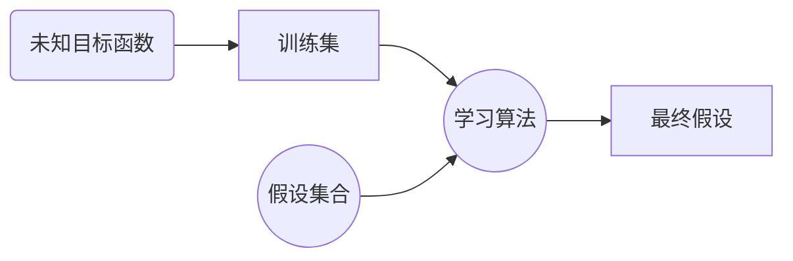

# 第二章 支持向量机与核算法

[TOC]

## 2.1 线性分类

### 基本符号

- $\mathcal{X} \in \mathbb{R}^d$：==输入空间==
- $\mathcal{Y} = \{-1,+1\}$：==输出空间==
- $f:\mathcal{X} \mapsto \mathcal{Y}$：==未知的目标函数==
- $S = \{(\pmb{x}_i,_i)\}_{i=1}^n$其中$\y_i=f(\pmb{x}_i)$，$\{\pmb{x}_i\}_{i=1}^n$从输入空间$X$中依据某个分布$D$采集得到：==训练集合==
- $\mathcal{H}=\{\pmb{x} \mapsto sig(\pmb{w}^T\pmb{x}+b):\pmb{w} \in \mathbb{R}^d,b \in \mathbb{R}\}$：==假说集合==
- $R_S(h)=\frac{1}{n}\sum\limits^n_{i=1}[h(\pmb{x}_i) \neq f(\pmb{x}_i)],h \in \mathcal{H}$：==经验误差==
- $R_D(h)=Pr_{\pmb{X} \sim D}[h(\pmb{x}) \neq f(\pmb{x})],h \in \mathcal{H}$：==泛化误差==

### 分类问题

**二分类问题形式化定义**：

给定训练样本集合$\textcolor{blue}{S=\{(\pmb{x}_1,y_1),\cdots,(\pmb{x}_n,y_n)\}}$，其中$\{\pmb{x}_i\}_{i=1}^n \subseteq \mathcal{X}^n$独立同分布，$y_i=\textcolor{blue}{f(\pmb{x}_i)} \in \mathcal{Y}(\forall i=1,\cdots,n)$。二分类问题的目标是基于数据$\textcolor{blue}{S}$，从假说集合$\mathcal{H}$中选择一个假说$h$，以使得==期望误差==
$$
E_{\pmb{x} \sim D}[h(\pmb{x} \neq f(\pmb{x}))]
$$
最小

其中
$$
\begin{align}
E_{\pmb{x} \sim D}[h(\pmb{x} \neq f(\pmb{x}))] &= 1 \cdot Pr_{\pmb{X} \sim D}(h(\pmb{x}) \neq f(\pmb{x}))+0 \cdot Pr_{\pmb{X} \sim D}(h(\pmb{x}) = f(\pmb{x})) \\
&= Pr_{\pmb{X} \sim D}(h(\pmb{x}) \sim f(\pmb{x}))
\end{align}
$$

### 学习一个分类器

==假说集（线性）==
$$
\mathcal{H}=\{\pmb{x} \mapsto sign(\pmb{w}^T\pmb{x}+b):\pmb{w} \in \mathbb{R}^d,b \in \mathbb{R} \}
$$
==学习算法==

$\mathcal{A}$：支持向量机（Support Vector Machines, SVMs）

## 2.2 支持向量机

### 线性分类算法

- 考虑超平面$\pmb{w}^T\pmb{x}+b=0$

- 给定$a>0$，要求该超平面满足

  - 对于正样本（即$y_i=1$）
    $$
    \pmb{w}^T\pmb{x}_i+b \geq a
    $$

  - 对于负样本（即$y_i=-1$）
    $$
    \pmb{w}^T\pmb{x}_i+b \leq a
    $$

  - 即$y_i(\pmb{w}^T\pmb{x}_i+b \geq a) \forall i$

**定义**（几何间隔）

样本$\pmb{x}_i$到超平面$\pmb{w}^T\pmb{x}+b=0$的几何距离：$\frac{|\pmb{w}^T\pmb{x}_i+b|}{\|\pmb{w}\|}=\frac{y_i(\pmb{w}_i\pmb{x}_i+b)}{\|\pmb{w}\|}$

样本集$S$到超平面$\pmb{w}^T\pmb{x}_i+b=0$的几何距离$\rho$被定义为：
$$
\rho=\min_{(\pmb{x}_i,y_i) \in S} \frac{y_i(\pmb{w}^T\pmb{x}_i+b)}{\|\pmb{w}\|}=\frac{a}{\|\pmb{w}\|}
$$

### 算法推导

#### 间隔最大化

> 支持向量机学习的基本想法是求解能够正确划分训练集并且几何间隔最大的分离超平面，对线性可分的训练集而言，线性可分分离超平面有无穷个（等价于感知机），但是==几何间隔最大的分离超平面是唯一的==。这里的间隔最大化又称为**硬间隔最大化**。
>
> 间隔最大化的直观解释是：对训练数据集找到几个间隔最大的超平面意味着以充分大的确信度对训练集进行分类。也就是说，==不仅将正负实例分开，而且对最难的实例（离超平面最近的点）也能够又足够大的确信度将它们分开==。[^1]

#### 最大间隔分离超平面

考虑如何求一个==几何间隔最大==的分离超平面，即最大间隔分离超平面，其可以表示为以下的约束最优化问题：
$$
\begin{align}
&\max_{\pmb{w},b} \rho=\frac{a}{\|\pmb{w}\|} \\
&s.t. \quad y_i(\pmb{w}_i^T\pmb{x}_i+b) \geq a,\forall i
\end{align}
$$
即希望最大化超平面$(\pmb{w},b)$关于训练数据集的几何间隔$\rho$，==约束条件表示的是超平面$(\pmb{w}_i,b)$关于每个训练样本点的几何间隔至少是$a$==。

==函数间隔$a$的取值并不影响最优化问题的解==。事实上，假设将$\pmb{w}$和$b$按比例改变为$\lambda \pmb{w}$和$\lambda b$，函数间隔的这一改变对上面最优化问题的不等式约束以及对目标函数的优化也没有影响。于是取$a=1$，令$\pmb{\hat{w}}=\frac{\pmb{w}}{a},\hat{b}=\frac{b}{a}$，则优化目标等价于
$$
\begin{align}
&\max_{\pmb{\hat{w}},\hat{b}} \frac{1}{\|\pmb{\hat{w}}\|} \\
&s.t.\quad y_i(\pmb{\hat{w}}^T\pmb{x}_i+\hat{b}) \geq 1,\forall i
\end{align}
$$
注意到==最大化$\frac{1}{\|\pmb{\hat{w}}\|}$与最小化$\frac{1}{2}\|\pmb{\hat{w}}\|^2$等价==，故优化问题等价于
$$
\begin{align}
&\min_{\pmb{\hat{w}},\hat{b}} \frac{1}{2}\|\pmb{\hat{w}}\|^2 \\
&s.t.\quad y_i(\pmb{\hat{w}}^T\pmb{x}_i+\hat{b}) \geq 1,\forall i
\end{align}
$$
这是一个凸二次规划问题。

>凸优化问题指的是约束最优化问题
>$$
>\begin{align}
>&\min_{w} f(w) \\
>&s.t.\quad g_i(w) \leq 0, \quad i=1,2,\cdots,k\\
>&\quad\quad~~~ h_i(w) = 0, i=1,2,\cdots,l
>\end{align}
>$$
>其中，目标函数$f(w)$和约束函数$g_i(w)$都是$\pmb{R}^n$上的连续可微凸函数，约束函数$h_i(w)$是$\pmb{R}^n$上的妨设函数。[^1][^2]

## 2.3 总结

[^1]:李航. 统计学习方法 第2版[M]. 清华大学出版社, 2019.
[^2]:$f(x)$称为妨设函数，如果它满足$f(x)=a \cdot x + b,c\in \pmb{R}^n,b \in \pmb{R},x \in \pmb{R}^n$